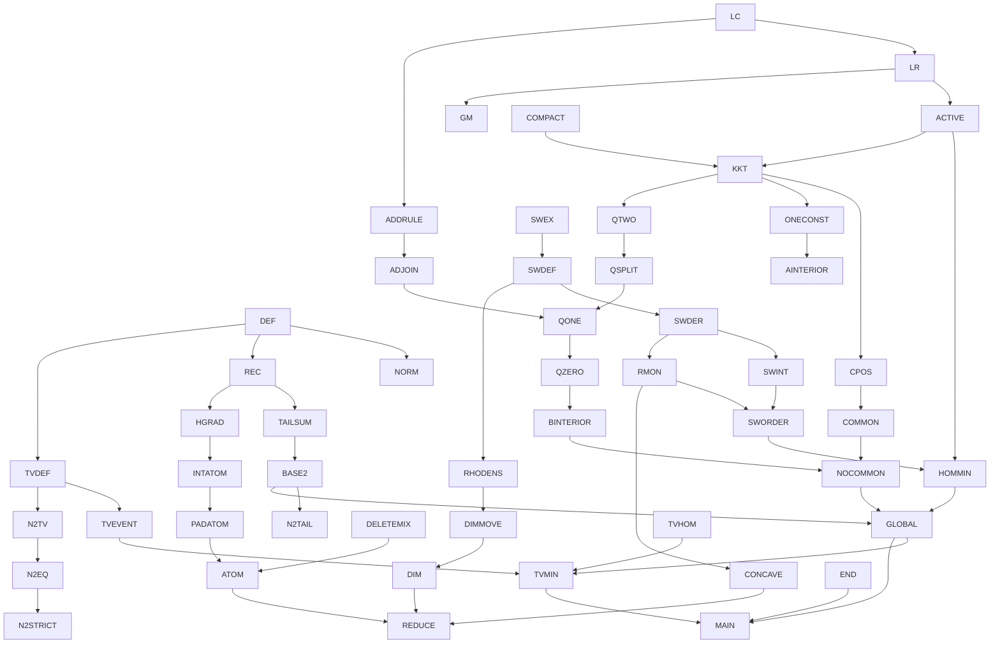

# Formalization coverage and continuation ledger

Source of truth: `poisson_binomial_comparison.tex` (mathematics unchanged).
The user authorized one editorial provenance correction: “GPT 6 Sol” →
“GPT-6 Astra”; the PDF was rebuilt successfully without LaTeX warnings.
Overall status: **IN PROGRESS**. This ledger is not a claim that the main theorem
has been proved. `PROVED` means the listed Lean declaration has compiled.
Dependencies in the tables form the directed graph: each listed dependency has
an edge into its row. Named results are tracked separately from their components.

## Current frontier

- Baseline on main: `a647a1778b051c37cb180dcc0ebc2e4118f56127`.
- Active milestone: `formalization/switch-geometry-and-stationarity`.
- Kernel-checked modules now additionally include `Coordinate`, `Endpoints`,
  `Reflection`, `TotalVariation`, `TotalVariationBounds`, `TwoDimensionalEquality`,
  `LogConcavity`, `Switch`, `Homogeneous`, `HomogeneousDerivative`,
  `RandomizedThreshold`, and `SwitchGeometry`.
- The complete two-dimensional appendix is proved, including the exact product
  family, its feasibility interval, both endpoints, and strict containment.
- Accepted next-layer modules: `LikelihoodRatio`, `ActiveThresholds`, `Adjoining`,
  `HomogeneousBlock`, `HomogeneousBlockMode`, `SwitchFunctions`, `SwitchDerivative`,
  `Compactness`, `FixedMean`, `Deterministic`, `BinomialAtom`, `Reindex`,
  `CommonCoordinate`, `TotalVariationHomogeneous`, `SwitchIntegral`,
  `MaximalAtom`, `DeletionMixture`, and `SwitchMaximum`.
- Accepted current modules: `ContinuousSwitch`, `ContinuousSwitchDerivative`,
  `ContinuousSwitchGeometry`, `SwitchRatioDerivative`, `SwitchMonotonicity`,
  `SwitchRhoDensity`, `HomogeneousMinimizer`, `SwitchOrdering`, `HomogeneousMinimum`,
  `BenchmarkConcavity`, `DimensionImprovement`, `GradientPositivity`,
  `ParameterDerivative`, `ConvexStationarity`, `FeasibleDirections`,
  `GapMultiplier`, `TailStationarity`, and `TailKKT`.
- Seven of eight named manuscript results are now proved. The main theorem and
  its global inhomogeneous equality classification remain unfinished.
- Current parallel targets: explicit benchmark formulas (`BenchmarkExplicit`),
  global minimizer boundary reductions (`DeletionObjective`, `MinimizerReduction`),
  and one-changing-vector homogeneity (`OneVectorConstant`). These are not yet
  accepted/imported.
- Parent next target: common-coordinate stationarity consequences (COMMON),
  followed by the remaining global homogeneity/equality argument. KKT and CPOS
  are proved independently of global minimality, from relative local minimality.
- Previous milestone merged as PR #4, squash commit `a647a1778b051c37cb180dcc0ebc2e4118f56127`.
- No established mathematical blocker. Independent audits of the Bernoulli,
  switch, and global-minimizer prose found none; those audits are not Lean proofs.
- Milestone validation: `lake build` exits 0, `Build completed successfully (5607 jobs).`
  All 532 public theorem declarations have only `propext`, `Classical.choice`,
  and `Quot.sound` dependencies. Source scan finds no proof placeholders or
  project-added axiom declarations.

## Named manuscript results (8)

| ID | Result / TeX label | Dependencies | Lean correspondence | Status |
|---|---|---|---|---|
| MAIN | Theorem `thm:main`: inequality, exact minimum, all equality cases, product-TV comparison | GLOBAL, HOMMIN, TVMIN, END, N2 | — | TODO |
| LR | Increasing a parameter, `lem:lr`, including strict adjacent comparison and support shifts | LC, REC | `pbMass_likelihoodRatio`, `pbMass_strict_adjacent_likelihoodRatio`, `pbMass_equal_adjacent_increase`, `pbMass_adjacent_disappear`, `pbMass_adjacent_sign_preserved`; adjoining variants in `LikelihoodRatio` | PROVED |
| ATOM | Maximal-atom bound and at-most-two-positive-gaps bound, `lem:atom` / `eq:two-gaps` | INTATOM, PADATOM, DELETEMIX | `exists_pbMass_ge_kappa` and `two_gap_lower_bound`; exact `kappa_eq_formula` and all deterministic/zero-gap cases | PROVED |
| ADJOIN | Derivative criterion for adjoining, `cor:adjoining` | GM, ADDRULE | `homogeneousBlockMass_adjacent_le_of_deriv_nonpos`, `homogeneousBlockMass_union_le_of_deriv_nonpos`; subset-law equivalence `homogeneousBlockMass_eq_union` | PROVED |
| SWITCH | Switch identities, `lem:switch-identities` | SWEX, SWDER, SWINT, RMON | Switch existence, derivatives, normalized integrals, `continuousSwitchRatio_strictAntiOn`, `deriv_switchRatio_le` in the switch modules | PROVED |
| ORDER | Strict ordering of switches, homogeneous minimizers, strict concavity/bounds, `prop:switch-order` | SWORDER, HOMMIN, CONCAVE | `switchValue_strict_order`, `homogeneous_minimum`, `homogeneous_minimum_eq_iff`, `strictConcaveOn_benchmark`, `benchmark_strict_bounds` | PROVED |
| DIM | Strict dimension improvement, `lem:dimension` | RHODENS, APPEND, HOMMIN | `dimension_improvement`, including the maximal old gap endpoint | PROVED |
| N2 | Complete two-dimensional equality families, `prop:n2-equality` | N2TAIL, N2TV, N2EQ, N2STRICT, END | `TwoDimensionalEquality` formulas, `productTV_two_eq_half_iff_family`, `twoFamily_admissible_iff`, `twoFamily_attains`, `exists_two_tail_minimizer_not_product`; endpoint theorems in `Endpoints` / `TotalVariationBounds` | PROVED |

## Definitions and elementary finite identities

| ID | Content / location | Dependencies | Lean correspondence | Status |
|---|---|---|---|---|
| DEF | S_p, count masses, D_k, T, Delta, admissibility; statement section | — | `bernoulliWeight`, `pbMassOn`, `pbTailOn`, `pbMass`, `pbTail`, `meanGap`, `tailDiff`, `tailObjective`, `ValidParameters`, `AdmissiblePair` | PROVED |
| NORM | Product weights and count masses nonnegative and normalized | DEF | `bernoulliWeight_nonneg`, `sum_bernoulliWeight`, `pbMass_nonneg`, `sum_pbMass` and `On` versions | PROVED |
| REC | One-coordinate insertion/deletion recurrences; zero and outside-support cases | DEF | `pbMassOn_insert_succ`, `pbMassOn_insert_zero`, `pbTailOn_insert_succ`, `pbMass_delete_succ`, `pbMass_delete_zero`, `pbTail_delete_succ`, zero/support lemmas in Basic | PROVED |
| TAILSUM | Tail as sum of masses; sum of upper tails equals mean; sum of differences equals gap | REC, NORM | `pbTail_eq_sum_mass`, `tailDiff_eq_sum_mass`, `sum_pbTailOn`, `sum_pbTail_range`, `sum_pbTail`, `sum_tailDiff`, `meanGap_eq_sum` | PROVED |
| MAX | Exact nonempty finite maximum, upper/lower bound interface and attainment | DEF | `tailObjective_eq_sup'`, `tailDiff_le_tailObjective`, `tailObjective_le_iff`, `tailObjective_attained`, `tailObjective_zero` | PROVED |
| BASE2 | n=2 tail lower bound and complementary homogeneous attainment | TAILSUM, MAX | `tailDiff_one_add_two`, `tailObjective_two`, `pbTail_two_two`, `twoDimensional_lower_bound`, `complementaryPair_two_attains` | PROVED |
| TVDEF | Algebraic product total variation, half sum of absolute signed outcome weights | DEF | `productTV`, `productTV_nonneg`, `productTV_self`, `productTV_symm`, `productTV_le_one` | PROVED |
| TVEVENT | Every event difference, in particular every D_k, is bounded by product TV | TVDEF, NORM | `eventDiff_le_productTV`, `tailDiff_le_productTV`, `tailObjective_le_productTV` | PROVED |
| REFLECT | Reflection (p,q) -> (1-q,1-p), preservation of gap and objective, threshold h -> n-h+1 | DEF, NORM | `bernoulliWeight_complement`, `pbMass_complement`, `pbTail_complement`, `meanGap_reflection`, `admissiblePair_reflection`, `tailDiff_reflection_of_mem`, `tailObjective_reflection` | PROVED |
| APPEND | Adjoining a common Bernoulli gives convex combinations of adjacent tail differences; common deterministic deletion | REC | `tailDiff_cons_common`, `meanGap_cons_common`, `tailObjective_cons_common_le`, `tailObjective_cons_zero`, `tailObjective_cons_one`; `Reindex` preserves arbitrary finite coordinate labeling | PROVED |
| END | Delta=0 forces p=q; Delta=n forces p=1,q=0; endpoint values and equality classifications | DEF, NORM, TVDEF | `meanGap_eq_zero_iff`, `meanGap_eq_dimension_iff`, objective endpoint theorems in `Endpoints` and `TotalVariationBounds` | PROVED |

Additional proved algebra/calculus interfaces:

- `Coordinate`: congruence on finite coordinate sets, adjacent-tail differences,
  exact one-coordinate updates, and parameter monotonicity (`pbTail_mono`,
  `tailDiff_nonneg`).
- `Homogeneous`: `pbMass_const` and `pbTail_const` identify subset sums with
  binomial formulas at every count, including outside support;
  `pbMass_const_eq_iff` identifies the switch equal-height equation.
- `HomogeneousDerivative`: exact Bernstein evaluation, mass derivatives,
  `hasDerivAt_pbTail_const_density`, and `IsSwitch.tailDiff_eq`. Exact maximization
  and active-set classification are proved in `SwitchMaximum`.

## Bernoulli facts and randomized tests (section 2)

| ID | Content / label | Dependencies | Lean correspondence | Status |
|---|---|---|---|---|
| LC | Interval support, strict log-concavity at positive interior triples, generating polynomial, Newton inequality; deterministic shifts | DEF, REC | `pbMassIntOn_cross`, `pbMassIntOn_strictLogConcavity`, `pbMass_logConcave`, `pbMass_strictLogConcave`, `pbMass_positive_between`; convolution proof replaces Newton argument | PROVED |
| ACTIVE | If Delta>0 and T<1, maximizing thresholds are one or two adjacent thresholds | LR, NORM | `activeThresholds_singleton_or_adjacent` (includes all support degeneracies) | PROVED |
| HDEF | Randomized adjacent-threshold test H and extra Bernoulli representation | REC | `randomizedTail`, `randomizedTailOn_eq_adjoin` | PROVED |
| HGRAD | Gradient, mixed coefficient and gradient-difference formulas (`eq:gradient`, `eq:coefficient`, `eq:grad-difference`); exact equal-coordinate split | HDEF, REC | `randomizedTail_update_sub`, `randomizedSlopeOn_eq_adjoin`, `randomizedCoefficientOn_eq_adjoin`, `randomizedGradient_sub`, `randomizedTail_split`; exact affine/quadratic identities replace differentiation | PROVED |
| INTATOM | Fixed-integer-mean mass minimization by equal interior parameters; deterministic shifts; binomial mass ratios and monotonicity of x log(1+1/x) | LC, HGRAD | `kappa_le_pbMass_at_integer_mean`, with fixed-mean averaging, deterministic decomposition, and both binomial log comparisons proved in supporting modules | PROVED |
| PADATOM | Pad (n-1) trials to integer mean to obtain maximal-atom bound | INTATOM, REC | `exists_pbMass_ge_kappa_succ`, `exists_pbMass_ge_kappa`, `exists_pbMassOn_ge_kappa_succ`; explicit integer-completion parameter and support bounds | PROVED |
| DELETEMIX | At most two gaps: symmetric expansion and normalized deletion mixture; real negative roots and degeneracy limits | DEF, REC | `tailDiff_eq_midpoint_deletion_sum`, `tailDiff_div_meanGap_eq_deletionMixture`, `deletionMixture_is_bernoulli_of_two_gaps`; direct two-factor proof replaces general root argument | PROVED |
| GM | g_M formula `eq:gM`, derivative, fixed support, unimodality, strict maximum M>=2, affine M=1 case | REC, LR, LC | `homogeneousBlockMass`, `homogeneousBlockMass_eq_union`, derivative formulas in `HomogeneousBlock`; support, derivative sign, closed-interval maximality, strictness and unique mode in `HomogeneousBlockMode` | PROVED |
| ADDRULE | Adjoining rule with positive target mass; strictness after two positive additions | LC, REC, LR | `pbMassIntOn_union_le_of_adjacent`, `pbMassIntOn_union_lt_of_two_positive_of_tie`, zero-below/no-recreation theorems in `Adjoining` | PROVED |

## Homogeneous switches and dimension improvement (sections 3–4)

| ID | Content / label | Dependencies | Lean correspondence | Status |
|---|---|---|---|---|
| SWEX | Existence and uniqueness of a,b at given n,j,gamma (`eq:switch`), with b<j/n<a; continuous endpoint extension | elementary polynomial/log calculus | `exists_switch`, `switch_unique`, `existsUnique_switch`, `IsSwitch.center_bounds`; endpoint continuity of upper/lower/value/mass in `SwitchFunctions` | PROVED |
| SWDEF | F_(n,j), central benchmark B_n and endpoints; f_j, c,v,x,y,R; denominator `eq:Rden` | SWEX, DEF | `switchPair`, `switchUpper`, `switchLower`, `switchValue`, `switchMass`, `benchmark`; denominator identities in `SwitchGeometry`; canonical specs and endpoint/reflection formulas in `SwitchFunctions` | PROVED |
| SWTIE | Equal count-j binomial masses give exactly tied maximizing thresholds j,j+1 | SWDEF, LR | `IsSwitch.tailObjective_eq`, `tailObjective_switchPair`, `IsSwitch.activeThresholds_eq` (exactly the two adjacent maximizing thresholds) | PROVED |
| SWDER | Differentiability of switches a,b; F'_j, f'_j/f_j (`eq:switch-derivatives`) | SWEX, HGRAD | `differentiableAt_switchLower`, `differentiableAt_switchUpper`, `deriv_switchUpper`, `deriv_switchLower`, `hasDerivAt_switchValue`, `deriv_switchMass_div`; genuine implicit-function proof | PROVED |
| SWINT | Normalized integral identities and integral f_j=1/(n+1) (`eq:switch-normalization`), including endpoint limits | SWDER, SWDEF | `switchValue_eq_integral_mass`, `integral_switchMass`, `intervalIntegrable_switchMass`; closed-interval endpoint cases included | PROVED |
| RMON | Logit paired-average inequalities; strict c monotonicity (`eq:Rcentering`), bound R'<=2R/gamma and reflection | SWEX, SWDER | `ContinuousSwitch` proves exact equivalence at c=j/n; `ContinuousSwitchGeometry` proves centering signs; `ContinuousSwitchDerivative` proves IFT count derivative; `SwitchMonotonicity` proves both assertions | PROVED |
| SWORDER | Strict switch ordering via log density-ratio derivative, equal integrals, single crossing; reflection F_(n,j)=F_(n,n-j) | RMON, SWINT | `switchValue_strict_order`, `switchValue_central_lt`, `switchValue_eq_central_iff`; `integral_endpoint_strict_comparison` replaces explicit crossing existence with equivalent sign cases | PROVED |
| HOMMIN | Homogeneous local minima must be switches; strict endpoint exclusion; exact central-switch equality cases | ACTIVE, SWORDER, SWTIE | `homogeneous_localMinOn_is_switch` includes both endpoint exclusions; `homogeneous_minimum` and `homogeneous_minimum_eq_iff` give exact comparison and central/reflected equality | PROVED |
| CONCAVE | Strict concavity of B_n for n>=3 and `eq:strict-linear`, initial slope kappa_n | SWDER, RMON, SWEX | `strictConcaveOn_benchmark` on closed [0,n], `hasDerivWithinAt_benchmark_zero_right`, `benchmark_strict_bounds` | PROVED |
| EXPLICIT | Odd integral `eq:odd-integral`, unique z representation, even integral formula, n=3 radical formula | SWEX, SWDER, SWINT | — | TODO |
| RHODENS | rho in (0,1), g(a)=g(b)=f/(1-R) (`eq:rho-density`) | SWDEF | `IsSwitch.rhoDensity_eq`, `switchRhoDensity_eq_switchMass`, actual Bernoulli-law equivalence and strict improvement derivative | PROVED |
| DIMMOVE | Appended rho has unique active threshold; feasible gap-preserving perturbation has strictly negative derivative, Delta=N endpoint | RHODENS, APPEND, SWTIE, HGRAD | `activeThresholds_cons_common`, `IsSwitch.hasDerivAt_dimensionPath`, `switch_dimension_improvement`, `exists_dimension_endpoint_improvement` | PROVED |

## Global minimizer (section 5)

| ID | Content / label | Dependencies | Lean correspondence | Status |
|---|---|---|---|---|
| COMPACT | Existence of minimizer at fixed feasible gap by compactness/continuity | DEF, MAX | `continuous_tailObjective`, `isCompact_feasiblePairs`, `feasiblePairs_nonempty`, `exists_tailObjective_minimizer` | PROVED |
| REDUCE | >=3 positive gaps; exclude common deterministic coordinates, p identically one and q identically zero | ATOM, CONCAVE, DIM, HOMMIN, BASE2 | — | TODO |
| KKT | Separating-hyperplane/tangent-cone stationarity for one or two active thresholds; multipliers and endpoint signs (`eq:KKTp`, `eq:KKTq`, `eq:KKTC`) | ACTIVE, COMPACT, HGRAD | `exists_tail_kkt`: finite-active-set reduction, Hahn–Banach separation, exact feasible rays, explicit gap transfers, all endpoint signs and nonnegative common-coordinate multipliers | PROVED |
| CPOS | Positive multiplier c (`eq:c-positive`) from support/gradient ranges, including endpoints | KKT, REDUCE, LC | `deleted_mass_pair_pos`, `randomizedGradient_multiplier_pos`, incorporated in `exists_tail_kkt`; includes boundary parameters and the pure final threshold | PROVED |
| COMMON | With common coordinates, exclude one active threshold; t=lambda (`eq:commonlambda`); tied common mass f=c+nu>0 (`eq:commonf`) | KKT, CPOS, LR, APPEND, REDUCE | — | TODO |
| ONECONST | Coefficient signs, strict LR contradiction, pairwise equality implies one changing vector constant (`eq:pa`) | KKT, CPOS, LR, HGRAD, REDUCE | — | TODO |
| AINTERIOR | Exclude a=1 by path of strict positive derivatives (`eq:a-interior`), c=g_(r-1)(a)>0 (`eq:ca`) | ONECONST, COMMON, LR, CPOS | — | TODO |
| QTWO | At most two distinct positive q entries, via three equal consecutive positive masses contradiction | KKT, HGRAD, LC, CPOS | — | TODO |
| QSPLIT | Smaller positive value has multiplicity one; second variation and implicit tie-preserving curve, including unique/two active cases | QTWO, KKT, LR, LC, HGRAD, ACTIVE | — | TODO |
| QONE | Exclude two positive values using g_M strict mode/adjoining, including M=1 | QSPLIT, GM, ADJOIN, AINTERIOR | — | TODO |
| QZERO | Exclude mixture of one positive q value and zeros, with all strictness cases | QONE, ADDRULE, LR, REDUCE, AINTERIOR | — | TODO |
| BINTERIOR | All changing q coordinates equal b with 0<b<a<1 (`eq:ab-interior`), reflected endpoint argument | QZERO, REFLECT, AINTERIOR | — | TODO |
| NOCOMMON | Relations `eq:nu`, unique mode, three lambda-location contradictions exclude all unchanged coordinates | BINTERIOR, COMMON, GM, LR, CPOS | — | TODO |
| GLOBAL | Induction proves all minimizers fully homogeneous and exactly central switches; main tail comparison and equality | BASE2, REDUCE, KKT, NOCOMMON, HOMMIN | — | TODO |

## Product total variation and appendix (sections 6–7)

| ID | Content / label | Dependencies | Lean correspondence | Status |
|---|---|---|---|---|
| TVHOM | Homogeneous product likelihood ratio is count-only and increasing, so product TV equals maximal count-tail difference | TVDEF, LR, SWTIE | `productTV_const_eq_tailObjective` including all endpoints and n=0; stronger `countTV_eq_tailObjective` for every admissible pair | PROVED |
| TVMIN | Exact product-TV minimum and all equality cases n>=3 | TVEVENT, TVHOM, GLOBAL | — | TODO |
| N2TAIL | T=Delta/2+abs(A-Delta/2) (`eq:n2-tail`); equality iff A=Delta/2 | BASE2 | `tailObjective_two_eq_abs`, `tailObjective_two_eq_half_iff` | PROVED |
| N2TV | Four signed atom differences and TV formula (`eq:n2-product`), 0<=A<=Delta | TVDEF, DEF | `twoTopGap_bounds`, `productTV_two_eq_abs` (four-atom expansion proved in private helper) | PROVED |
| N2EQ | Product equality iff d1=d2=A=d; equivalent explicit family (`eq:n2-family`); feasibility iff 0<=r<=1-d; attainment | N2TV, BASE2 | `productTV_two_eq_half_iff`, `productTV_two_eq_half_iff_family`, `twoFamily_admissible_iff`, `twoFamily_attains`, `productTV_two_lower_bound`, `complementaryPair_two_product_attains` | PROVED |
| N2STRICT | Product minimizers are a proper subset of tail minimizers at each 0<Delta<2, explicit epsilon witness | N2EQ, N2TAIL | `productTV_two_eq_half_implies_tail`, `asymmetricPair_two_objectives`, `exists_two_tail_minimizer_not_product` | PROVED |

## Dependency graph (major chains)

## Representation and integrity notes

- Outcomes are successful-coordinate subsets. `pbMass_eq_sum_subsets` and
  `pbTail_eq_sum_mass` establish the finite representation directly. No
  probability-space representation is assumed without proof.
- Existing algebraic identities hold for arbitrary real parameters; probability
  nonnegativity and admissibility are stated separately. The n=2 lower bound is
  stronger than the manuscript but its attaining pair satisfies exactly the
  manuscript hypotheses and formula.
- Counts are natural; successor-indexed recurrences have separate zero cases.
- `tailObjective_eq_sup'` gives the exact nonempty maximum for n>0. The convention
  T=0 for n=0 does not insert zero as a candidate for positive dimensions.
- Switch endpoints need explicit continuous extensions: a=b=j/n at gamma=0,
  a=1,b=0 at gamma=1. The prose invokes these before spelling out extensions.
- No proof-critical omission may be marked PROVED merely from numerical checks.
- Never change manuscript hypotheses/conclusions to accommodate a Lean proof.

## Proof design and continuation details

- `pbMassIntOn` extends natural-count masses by zero to integers;
  `pbMassIntOn_natCast` proves agreement. Strict log-concavity and interval
  support are proved directly by convolution, so the manuscript's Newton/root
  argument is replaced rather than assumed. All deterministic cases are included.
- The appendix uses indices `0,1` for manuscript indices `1,2`; the explicit
  family is represented with `if i = 0 then ... else ...`. Its feasibility is
  proved as an equivalence, and the family theorem includes both gap endpoints.
- The positive-gap equality classification needs only `0 < meanGap`; feasibility
  already forces the upper bound. The strict-containment witness uses
  epsilon = min(d,1-d)/2, which is positive for 0<Delta<2.
- Homogeneous derivatives reuse mathlib's Bernstein polynomial derivatives and
  the adjacent-tail identity. They hold for arbitrary real parameters.
- Future two-gap deletion-mixture proof can factor out common n-2 factors and
  combine the two remaining Bernoulli factors algebraically, avoiding general
  real-rootedness for that proof-critical case. Do not assert the broader
  real-rootedness claim without proof if it becomes a needed dependency.
- `SwitchGeometry`: Rolle's theorem puts j/n strictly between b and a;
  exact reflection, normalized denominator and 0<R<1 are proved. The adjoined
  coordinate `switchRho` is strictly interior and its exact density equality
  is proved in `SwitchRhoDensity`.

- `FixedMean` proves a general symmetric-quadratic averaging lemma, then applies
  it to count masses at every feasible real mean. Its secondary objective is
  `squareSum`. The exact finite update formula proves all pair transfers stay
  feasible; averaging and spreading force the mixed coefficient to vanish,
  after which averaging strictly reduces the secondary objective. Integer mean
  is only needed in the subsequent binomial lower bound, not in this reduction.
- `SwitchFunctions` clamps outside [0,1] to endpoint values. On the manuscript
  domain its unique-switch specification, gap, reflection, endpoint formulas,
  and continuous endpoint extensions are proved. Interior smoothness is
  proved in `SwitchDerivative` using the implicit function theorem.

- `BinomialAtom` factors integer-mean masses using m^m/m!, including m=0,
  then proves the manuscript's log-ratio identities and numerical comparisons.
  `kappa_eq_formula` proves agreement with the floor/ceiling formula for n>0.
- `Deterministic` identifies both mean and entire integer-indexed law of an
  equal-interior vector as a deterministic shift plus a binomial; the resulting
  integer-mean comparison preserves dimensions and all deterministic cases.
- `Reindex.finsetParameters` enumerates arbitrary finite coordinate sets with
  exactly their cardinality; mass, tail, validity and mean equivalences are proved.
- `HomogeneousBlockMode` proves strict maximality even against both endpoints.
  `TotalVariationHomogeneous` proves a stronger intermediate count-TV identity
  for every ordered pair, then exact product-TV equality for homogeneous pairs.
- `SwitchDerivative` uses mathlib's actual implicit function theorem to establish
  differentiability before differentiating the switch equations. No regularity
  premise is assumed. It proves both derivative identities and closed-interval
  continuity needed for integration.

- `MaximalAtom` completes the fixed-mean reduction and pads an arbitrary law to
  integer mean with t=floor(mean)+1-mean. The positive kappa bound ensures the
  selected original mass lies inside its support range.
- `DeletionMixture` proves the entire at-most-two-gap estimate by exact midpoint
  expansion and a direct one-Bernoulli mixture. The realization is literally on
  `Fin (n-1)` via the proved reindexing interface. This replaces the manuscript's
  broader real-rootedness detour for the only mixture class used downstream.
- `SwitchMaximum` proves exact attainment and the full two-threshold active set;
  it also proves product TV<1 whenever the two laws share a positive atom.

- `ContinuousSwitchGeometry` replaces the logistic paired-average integral
  argument by additive and odds-reflection comparisons of the same logarithmic
  height. Exact geometric identities prove the signs used in RMON.
- Homogeneous endpoint exclusion uses a negative one-sided derivative and
  reflection rather than an auxiliary coupling. The exact feasible minimum and
  equality classification are preserved, including both gap endpoints.
- `ConvexStationarity` separates the two-dimensional gradient image from the
  negative quadrant. `FeasibleDirections` proves every allowed direction is an
  actual feasible positive ray. `GapMultiplier` uses explicit unit-gap transfers
  and a finite maximum, covering cases with no free changing coordinate.
- `TailKKT.exists_tail_kkt` includes active-threshold support of the randomizing
  weight and the strictly positive scalar multiplier. No constraint
  qualification, differentiability of the maximum, or stationarity is assumed.
