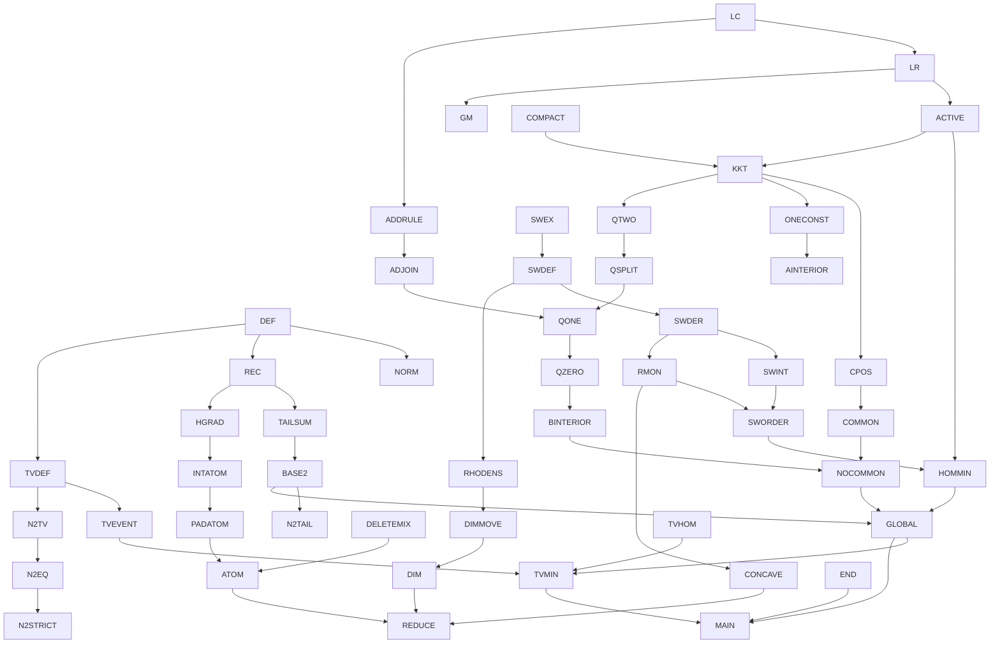

# Formalization coverage and continuation ledger

Source of truth: `poisson_binomial_comparison.tex` (unchanged).
Overall status: **IN PROGRESS**. This ledger is not a claim that the main theorem
has been proved. `PROVED` means the listed Lean declaration has compiled.
Dependencies in the tables form the directed graph: each listed dependency has
an edge into its row. Named results are tracked separately from their components.

## Current frontier

- Baseline on main: `7158f355d1fb603ca40846bfc7bd014993a14718`.
- Active milestone: `formalization/coverage-and-finite-tv`.
- Kernel-checked modules now additionally include `Coordinate`, `Endpoints`,
  `Reflection`, `TotalVariation`, `TotalVariationBounds`, `TwoDimensionalEquality`,
  `LogConcavity`, `Switch`, `Homogeneous`, `HomogeneousDerivative`,
  `RandomizedThreshold`, and `SwitchGeometry`.
- The complete two-dimensional appendix is proved, including the exact product
  family, its feasibility interval, both endpoints, and strict containment.
- Current parallel targets: likelihood-ratio order (`LikelihoodRatio.lean`),
  the adjoining rule (`Adjoining.lean`),
  and switch functions/endpoint extensions (`SwitchFunctions.lean`). These files are work in progress
  until explicitly listed as accepted below; they are not imported by the root.
- Next parent target after validating/merging this milestone: continuity and
  compact fixed-gap minimizer existence, then adjoining/atom dependencies.
- No established mathematical blocker. Independent audits of the Bernoulli,
  switch, and global-minimizer prose found none; those audits are not Lean proofs.
- Milestone validation: `lake build` exits 0, `Build completed successfully (4203 jobs).`
  All 153 public theorem declarations have only `propext`, `Classical.choice`,
  and `Quot.sound` dependencies. Source scan finds no proof placeholders or
  project-added axiom declarations.

## Named manuscript results (8)

| ID | Result / TeX label | Dependencies | Lean correspondence | Status |
|---|---|---|---|---|
| MAIN | Theorem `thm:main`: inequality, exact minimum, all equality cases, product-TV comparison | GLOBAL, HOMMIN, TVMIN, END, N2 | — | TODO |
| LR | Increasing a parameter, `lem:lr`, including strict adjacent comparison and support shifts | LC, REC | — | TODO |
| ATOM | Maximal-atom bound and at-most-two-positive-gaps bound, `lem:atom` / `eq:two-gaps` | INTATOM, PADATOM, DELETEMIX | — | TODO |
| ADJOIN | Derivative criterion for adjoining, `cor:adjoining` | GM, ADDRULE | — | TODO |
| SWITCH | Switch identities, `lem:switch-identities` | SWEX, SWDER, SWINT, RMON | — | TODO |
| ORDER | Strict ordering of switches, homogeneous minimizers, strict concavity/bounds, `prop:switch-order` | SWORDER, HOMMIN, CONCAVE | — | TODO |
| DIM | Strict dimension improvement, `lem:dimension` | RHODENS, APPEND, HOMMIN | — | TODO |
| N2 | Complete two-dimensional equality families, `prop:n2-equality` | N2TAIL, N2TV, N2EQ, N2STRICT, END | `TwoDimensionalEquality` formulas, `productTV_two_eq_half_iff_family`, `twoFamily_admissible_iff`, `twoFamily_attains`, `exists_two_tail_minimizer_not_product`; endpoint theorems in `Endpoints` / `TotalVariationBounds` | PROVED |

## Definitions and elementary finite identities

| ID | Content / location | Dependencies | Lean correspondence | Status |
|---|---|---|---|---|
| DEF | S_p, count masses, D_k, T, Delta, admissibility; statement section | — | `bernoulliWeight`, `pbMassOn`, `pbTailOn`, `pbMass`, `pbTail`, `meanGap`, `tailDiff`, `tailObjective`, `ValidParameters`, `AdmissiblePair` | PROVED |
| NORM | Product weights and count masses nonnegative and normalized | DEF | `bernoulliWeight_nonneg`, `sum_bernoulliWeight`, `pbMass_nonneg`, `sum_pbMass` and `On` versions | PROVED |
| REC | One-coordinate insertion/deletion recurrences; zero and outside-support cases | DEF | `pbMassOn_insert_succ`, `pbMassOn_insert_zero`, `pbTailOn_insert_succ`, `pbMass_delete_succ`, `pbMass_delete_zero`, `pbTail_delete_succ`, zero/support lemmas in Basic | PROVED |
| TAILSUM | Tail as sum of masses; sum of upper tails equals mean; sum of differences equals gap | REC, NORM | `pbTail_eq_sum_mass`, `tailDiff_eq_sum_mass`, `sum_pbTailOn`, `sum_pbTail_range`, `sum_pbTail`, `sum_tailDiff`, `meanGap_eq_sum` | PROVED |
| MAX | Exact nonempty finite maximum, upper/lower bound interface and attainment | DEF | `tailObjective_eq_sup'`, `tailDiff_le_tailObjective`, `tailObjective_le_iff`, `tailObjective_attained`, `tailObjective_zero` | PROVED |
| BASE2 | n=2 tail lower bound and complementary homogeneous attainment | TAILSUM, MAX | `tailDiff_one_add_two`, `tailObjective_two`, `pbTail_two_two`, `twoDimensional_lower_bound`, `complementaryPair_two_attains` | PROVED |
| TVDEF | Algebraic product total variation, half sum of absolute signed outcome weights | DEF | `productTV`, `productTV_nonneg`, `productTV_self`, `productTV_symm`, `productTV_le_one` | PROVED |
| TVEVENT | Every event difference, in particular every D_k, is bounded by product TV | TVDEF, NORM | `eventDiff_le_productTV`, `tailDiff_le_productTV`, `tailObjective_le_productTV` | PROVED |
| REFLECT | Reflection (p,q) -> (1-q,1-p), preservation of gap and objective, threshold h -> n-h+1 | DEF, NORM | `bernoulliWeight_complement`, `pbMass_complement`, `pbTail_complement`, `meanGap_reflection`, `admissiblePair_reflection`, `tailDiff_reflection_of_mem`, `tailObjective_reflection` | PROVED |
| APPEND | Adjoining a common Bernoulli gives convex combinations of adjacent tail differences; common deterministic deletion | REC | — | TODO |
| END | Delta=0 forces p=q; Delta=n forces p=1,q=0; endpoint values and equality classifications | DEF, NORM, TVDEF | `meanGap_eq_zero_iff`, `meanGap_eq_dimension_iff`, objective endpoint theorems in `Endpoints` and `TotalVariationBounds` | PROVED |

Additional proved algebra/calculus interfaces:

- `Coordinate`: congruence on finite coordinate sets, adjacent-tail differences,
  exact one-coordinate updates, and parameter monotonicity (`pbTail_mono`,
  `tailDiff_nonneg`).
- `Homogeneous`: `pbMass_const` and `pbTail_const` identify subset sums with
  binomial formulas at every count, including outside support;
  `pbMass_const_eq_iff` identifies the switch equal-height equation.
- `HomogeneousDerivative`: exact Bernstein evaluation, mass derivatives,
  `hasDerivAt_pbTail_const_density`, and `IsSwitch.tailDiff_eq`. Maximization
  at the tied thresholds still requires the LR step.

## Bernoulli facts and randomized tests (section 2)

| ID | Content / label | Dependencies | Lean correspondence | Status |
|---|---|---|---|---|
| LC | Interval support, strict log-concavity at positive interior triples, generating polynomial, Newton inequality; deterministic shifts | DEF, REC | `pbMassIntOn_cross`, `pbMassIntOn_strictLogConcavity`, `pbMass_logConcave`, `pbMass_strictLogConcave`, `pbMass_positive_between`; convolution proof replaces Newton argument | PROVED |
| ACTIVE | If Delta>0 and T<1, maximizing thresholds are one or two adjacent thresholds | LR, NORM | — | TODO |
| HDEF | Randomized adjacent-threshold test H and extra Bernoulli representation | REC | `randomizedTail`, `randomizedTailOn_eq_adjoin` | PROVED |
| HGRAD | Gradient, mixed coefficient and gradient-difference formulas (`eq:gradient`, `eq:coefficient`, `eq:grad-difference`); exact equal-coordinate split | HDEF, REC | `randomizedTail_update_sub`, `randomizedSlopeOn_eq_adjoin`, `randomizedCoefficientOn_eq_adjoin`, `randomizedGradient_sub`, `randomizedTail_split`; exact affine/quadratic identities replace differentiation | PROVED |
| INTATOM | Fixed-integer-mean mass minimization by equal interior parameters; deterministic shifts; binomial mass ratios and monotonicity of x log(1+1/x) | LC, HGRAD | — | TODO |
| PADATOM | Pad (n-1) trials to integer mean to obtain maximal-atom bound | INTATOM, REC | — | TODO |
| DELETEMIX | At most two gaps: symmetric expansion and normalized deletion mixture; real negative roots and degeneracy limits | DEF, REC | — | TODO |
| GM | g_M formula `eq:gM`, derivative, fixed support, unimodality, strict maximum M>=2, affine M=1 case | REC, LR, LC | — | TODO |
| ADDRULE | Adjoining rule with positive target mass; strictness after two positive additions | LC, REC, LR | — | TODO |

## Homogeneous switches and dimension improvement (sections 3–4)

| ID | Content / label | Dependencies | Lean correspondence | Status |
|---|---|---|---|---|
| SWEX | Existence and uniqueness of a,b at given n,j,gamma (`eq:switch`), with b<j/n<a; continuous endpoint extension | elementary polynomial/log calculus | `IsSwitch`, `exists_switch`, `switch_unique`, `existsUnique_switch`, `IsSwitch.center_bounds`; continuous endpoint extension remains | IN PROGRESS |
| SWDEF | F_(n,j), central benchmark B_n and endpoints; f_j, c,v,x,y,R; denominator `eq:Rden` | SWEX, DEF | — | TODO |
| SWTIE | Equal count-j binomial masses give exactly tied maximizing thresholds j,j+1 | SWDEF, LR | — | TODO |
| SWDER | Differentiability of switches a,b; F'_j, f'_j/f_j (`eq:switch-derivatives`) | SWEX, HGRAD | — | TODO |
| SWINT | Normalized integral identities and integral f_j=1/(n+1) (`eq:switch-normalization`), including endpoint limits | SWDER, SWDEF | — | TODO |
| RMON | Logit paired-average inequalities; strict c monotonicity (`eq:Rcentering`), bound R'<=2R/gamma and reflection | SWEX, SWDER | — | TODO |
| SWORDER | Strict switch ordering via log density-ratio derivative, equal integrals, single crossing; reflection F_(n,j)=F_(n,n-j) | RMON, SWINT | — | TODO |
| HOMMIN | Homogeneous local minima must be switches; strict endpoint exclusion; exact central-switch equality cases | ACTIVE, SWORDER, SWTIE | — | TODO |
| CONCAVE | Strict concavity of B_n for n>=3 and `eq:strict-linear`, initial slope kappa_n | SWDER, RMON, SWEX | — | TODO |
| EXPLICIT | Odd integral `eq:odd-integral`, unique z representation, even integral formula, n=3 radical formula | SWEX, SWDER, SWINT | — | TODO |
| RHODENS | rho in (0,1), g(a)=g(b)=f/(1-R) (`eq:rho-density`) | SWDEF | `switchRho`, `IsSwitch.switchRho_mem_Ioo`; density equality remains | IN PROGRESS |
| DIMMOVE | Appended rho has unique active threshold; feasible gap-preserving perturbation has strictly negative derivative, Delta=N endpoint | RHODENS, APPEND, SWTIE, HGRAD | — | TODO |

## Global minimizer (section 5)

| ID | Content / label | Dependencies | Lean correspondence | Status |
|---|---|---|---|---|
| COMPACT | Existence of minimizer at fixed feasible gap by compactness/continuity | DEF, MAX | — | TODO |
| REDUCE | >=3 positive gaps; exclude common deterministic coordinates, p identically one and q identically zero | ATOM, CONCAVE, DIM, HOMMIN, BASE2 | — | TODO |
| KKT | Separating-hyperplane/tangent-cone stationarity for one or two active thresholds; multipliers and endpoint signs (`eq:KKTp`, `eq:KKTq`, `eq:KKTC`) | ACTIVE, COMPACT, HGRAD | — | TODO |
| CPOS | Positive multiplier c (`eq:c-positive`) from support/gradient ranges, including endpoints | KKT, REDUCE, LC | — | TODO |
| COMMON | With common coordinates, exclude one active threshold; t=lambda (`eq:commonlambda`); tied common mass f=c+nu>0 (`eq:commonf`) | KKT, CPOS, LR, APPEND, REDUCE | — | TODO |
| ONECONST | Coefficient signs, strict LR contradiction, pairwise equality implies one changing vector constant (`eq:pa`) | KKT, CPOS, LR, HGRAD, REDUCE | — | TODO |
| AINTERIOR | Exclude a=1 by path of strict positive derivatives (`eq:a-interior`), c=g_(r-1)(a)>0 (`eq:ca`) | ONECONST, COMMON, LR, CPOS | — | TODO |
| QTWO | At most two distinct positive q entries, via three equal consecutive positive masses contradiction | KKT, HGRAD, LC, CPOS | — | TODO |
| QSPLIT | Smaller positive value has multiplicity one; second variation and implicit tie-preserving curve, including unique/two active cases | QTWO, KKT, LR, LC, HGRAD, ACTIVE | — | TODO |
| QONE | Exclude two positive values using g_M strict mode/adjoining, including M=1 | QSPLIT, GM, ADJOIN, AINTERIOR | — | TODO |
| QZERO | Exclude mixture of one positive q value and zeros, with all strictness cases | QONE, ADDRULE, LR, REDUCE, AINTERIOR | — | TODO |
| BINTERIOR | All changing q coordinates equal b with 0<b<a<1 (`eq:ab-interior`), reflected endpoint argument | QZERO, REFLECT, AINTERIOR | — | TODO |
| NOCOMMON | Relations `eq:nu`, unique mode, three lambda-location contradictions exclude all unchanged coordinates | BINTERIOR, COMMON, GM, LR, CPOS | — | TODO |
| GLOBAL | Induction proves all minimizers fully homogeneous and exactly central switches; main tail comparison and equality | BASE2, REDUCE, KKT, NOCOMMON, HOMMIN | — | TODO |

## Product total variation and appendix (sections 6–7)

| ID | Content / label | Dependencies | Lean correspondence | Status |
|---|---|---|---|---|
| TVHOM | Homogeneous product likelihood ratio is count-only and increasing, so product TV equals maximal count-tail difference | TVDEF, LR, SWTIE | — | TODO |
| TVMIN | Exact product-TV minimum and all equality cases n>=3 | TVEVENT, TVHOM, GLOBAL | — | TODO |
| N2TAIL | T=Delta/2+abs(A-Delta/2) (`eq:n2-tail`); equality iff A=Delta/2 | BASE2 | `tailObjective_two_eq_abs`, `tailObjective_two_eq_half_iff` | PROVED |
| N2TV | Four signed atom differences and TV formula (`eq:n2-product`), 0<=A<=Delta | TVDEF, DEF | `twoTopGap_bounds`, `productTV_two_eq_abs` (four-atom expansion proved in private helper) | PROVED |
| N2EQ | Product equality iff d1=d2=A=d; equivalent explicit family (`eq:n2-family`); feasibility iff 0<=r<=1-d; attainment | N2TV, BASE2 | `productTV_two_eq_half_iff`, `productTV_two_eq_half_iff_family`, `twoFamily_admissible_iff`, `twoFamily_attains`, `productTV_two_lower_bound`, `complementaryPair_two_product_attains` | PROVED |
| N2STRICT | Product minimizers are a proper subset of tail minimizers at each 0<Delta<2, explicit epsilon witness | N2EQ, N2TAIL | `productTV_two_eq_half_implies_tail`, `asymmetricPair_two_objectives`, `exists_two_tail_minimizer_not_product` | PROVED |

## Dependency graph (major chains)

## Representation and integrity notes

- Outcomes are successful-coordinate subsets. `pbMass_eq_sum_subsets` and
  `pbTail_eq_sum_mass` establish the finite representation directly. No
  probability-space representation is assumed without proof.
- Existing algebraic identities hold for arbitrary real parameters; probability
  nonnegativity and admissibility are stated separately. The n=2 lower bound is
  stronger than the manuscript but its attaining pair satisfies exactly the
  manuscript hypotheses and formula.
- Counts are natural; successor-indexed recurrences have separate zero cases.
- `tailObjective_eq_sup'` gives the exact nonempty maximum for n>0. The convention
  T=0 for n=0 does not insert zero as a candidate for positive dimensions.
- Switch endpoints need explicit continuous extensions: a=b=j/n at gamma=0,
  a=1,b=0 at gamma=1. The prose invokes these before spelling out extensions.
- No proof-critical omission may be marked PROVED merely from numerical checks.
- Never change manuscript hypotheses/conclusions to accommodate a Lean proof.

## Proof design and continuation details

- `pbMassIntOn` extends natural-count masses by zero to integers;
  `pbMassIntOn_natCast` proves agreement. Strict log-concavity and interval
  support are proved directly by convolution, so the manuscript's Newton/root
  argument is replaced rather than assumed. All deterministic cases are included.
- The appendix uses indices `0,1` for manuscript indices `1,2`; the explicit
  family is represented with `if i = 0 then ... else ...`. Its feasibility is
  proved as an equivalence, and the family theorem includes both gap endpoints.
- The positive-gap equality classification needs only `0 < meanGap`; feasibility
  already forces the upper bound. The strict-containment witness uses
  epsilon = min(d,1-d)/2, which is positive for 0<Delta<2.
- Homogeneous derivatives reuse mathlib's Bernstein polynomial derivatives and
  the adjacent-tail identity. They hold for arbitrary real parameters.
- Future two-gap deletion-mixture proof can factor out common n-2 factors and
  combine the two remaining Bernoulli factors algebraically, avoiding general
  real-rootedness for that proof-critical case. Do not assert the broader
  real-rootedness claim without proof if it becomes a needed dependency.
- `SwitchGeometry`: Rolle's theorem puts j/n strictly between b and a;
  exact reflection, normalized denominator and 0<R<1 are proved. The adjoined
  coordinate `switchRho` is proved strictly interior, but its density equality
  remains open.
